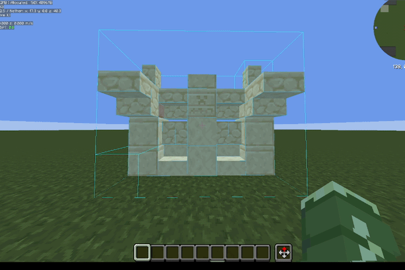

# Litematica Printer

This extension adds printing functionality for [Litematica fabric](https://github.com/maruohon/litematica). Printer
allows players to build big structures more quickly by automatically placing the correct blocks around you.

## Notice

This is a fork made mainly for personal use, meaning I will update it as I find needed. It is not reccomended to use this fork unless it is either your only option or you are prepaired for possible issues. (For simplicity I've kept most things in this fork very similar to the original printer addon)

## Issues

If you have issues with the printer, **do not** bother the original creator of
Litematica (nor Litematica Printer) with them. Contact me instead. Feature requests or bugs can
be reported via [GitHub issues](https://github.com/NotAUser-1059/litematica-printer/issues),
or in my Discord DMs (\_notauser\_). I'll try to keep a todo list of things
I'm planning to implement and fix, so please look for duplicates there first.

Before creating an issue, make sure you are using the latest version of the mod.
To make fixing bugs easier, include the following information in your issue:

- Minecraft version
- Litematica version
- Printer version
- Detailed description of how to reproduce the issue
- If you can, any additional information, such as error logs, screenshots or **the incorrectly printed schematics**.

### List of know issues

Currently, the following features are still broken or missing:

- Placing liquids (printing **in** liquids works though)
- Printing without support directly in air (printInAir)
- Current algorithm for placing rails isn't perfect,
  sometimes it can't place all the rails (to avoid placing anything incorrectly).
- Legit mode? (for anticheats)

## Building and Contributing

> Build requirement: use Java 21 (for example: `JAVA_HOME=/usr/lib/jvm/java-21 ./gradlew build`).

Useful gradle tasks:

- `v1_21:syncImplementations`
    - Copy common code from `v1_21` to the other version implementations
- `build`
    - Build the prioritized latest implementation
- `v1_21:runClient`
    - Start the 1.21 development client
